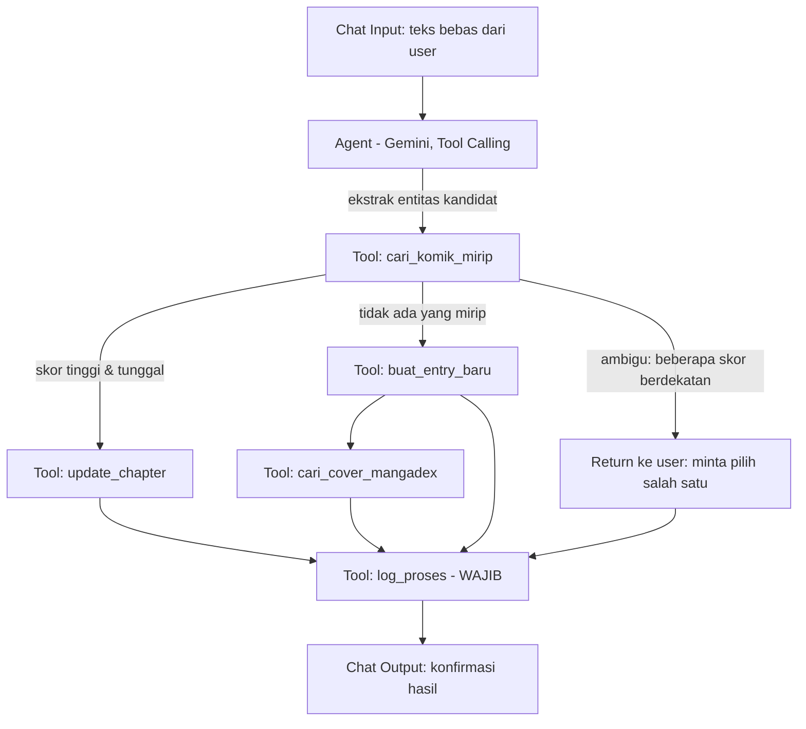

# Desain Flow Langflow — Komik Tracker Agent

## Alur

## Komponen

1. **Chat Input** — menerima teks bebas dari halaman Tulis (dikirim lewat Cloudflare Worker)

2. **Agent** (komponen Google Generative AI, tool calling diaktifkan)
   - Tugas: ekstraksi entitas dari teks bebas (judul kandidat, jenis dasar, **is_adult (boolean, terpisah dari jenis)**, nomor chapter, status opsional)
   - Draft system prompt: "Anda mengekstrak info komik dari teks bebas pengguna: judul, jenis (manga/manhwa/manhua), is_adult (true/false, JANGAN digabung ke jenis), nomor chapter, status opsional. Anda WAJIB memanggil tool cari_komik_mirip sebelum memutuskan membuat entry baru atau meng-update. Jangan menentukan kecocokan judul sendiri tanpa memanggil tool tersebut."
   - API key Gemini diisi lewat `tweaks` saat run (lihat SPEC.md §3), bukan hardcode di komponen

3. **Tool: cari_komik_mirip** *(kontrak final menyusul — lihat Catatan Implementasi)*
   - Input: `judul_kandidat` (text)
   - Output: list `{comic_id, title, score}`
   - Logika pencocokan (normalisasi + fuzzy match) harus deterministik, dikerjakan kode backend — bukan oleh reasoning agent

4. **Tool: buat_entry_baru**
   - Input: `title, type_tag, is_adult, chapter, status?`
   - Setelah sukses, lanjut panggil `cari_cover_mangadex` (langkah 5)

5. **Tool: cari_cover_mangadex**
   - Input: `title`
   - Output: `cover_url` (nullable — kalau MangaDex tidak punya entri untuk judul ini, kosongkan dan biarkan user upload manual dari halaman visual)
   - Hanya dipanggil untuk entry baru, bukan saat update chapter

6. **Tool: update_chapter**
   - Input: `comic_id, chapter, status?`

7. **Tool: log_proses** *(WAJIB dipanggil di SEMUA cabang — lihat SPEC.md §9 audit trail)*
   - Input: `input_text, ai_action (created/updated/ambiguous), target_comic_id?, confirmed`
   - Menulis ke tabel `process_log`

8. **Chat Output** — hasil balik ke user: entry baru dibuat / chapter diupdate / butuh konfirmasi karena ambigu

## Prinsip yang tidak boleh dilanggar saat implementasi
- Agent tidak pernah menulis ke database berdasarkan keputusannya sendiri tanpa lewat tool `cari_komik_mirip` terlebih dahulu
- Kasus ambigu (skor berdekatan) selalu dikembalikan ke user, tidak di-auto-pilih oleh agent
- `is_adult` tidak boleh digabung/disisipkan ke dalam `type_tag` dengan cara apapun (pelajaran dari bug 'p' di sistem lama — lihat SPEC.md §8)
- `log_proses` dipanggil di SETIAP cabang alur (bukan hanya saat sukses) — audit trail wajib mencakup kasus ambigu juga

## Catatan Implementasi
Tool #3, #4, #6 (dan #5, #7) memanggil endpoint di Worker Hono, path `/internal/tools/*` — kontrak lengkap (request/response, auth internal, aturan ambang skor, rate limit MangaDex) ada di `TOOL_CONTRACTS.md`.
